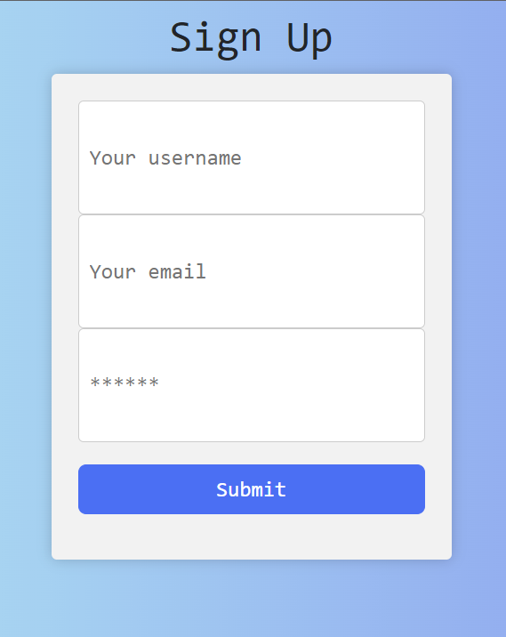

# NOIR APP
## Description
This is an app that displays cards that contain information about different black historical figures in tech. It requires users to sign up or login in order to view the cards. Each card contains a brief biography of the individual, as well as details of their accomplishments and impact on the field. The app also provides links to further reading, allowing users to explore the subject in greater depth. The app is designed to provide an accessible way to learn more about the important contributions of African-American inventors, entrepreneurs, and scientists in the tech industry. 

## App Usage
The user must log in or sign up to access cards. They can scroll through the cards and click on a link to view more detailed information about the person. The user can also save their favorite cards to their profile

## Lessons
-Learnt a lot about the MERN stack and how to use it to create a full-stack application. 
-Learnt how to create a react app on the front end using Node.JS and Express.js on the backend with MongoDB as the server. 
-Learnt about authentication and authorization(with logins, etc) and how to securely store data

## Challenges
-Connecting database information from backend to display on the front end
-Getting React components to render the cards
-Deploying to Heroku
-Merge conflicts

## Technologies used
-Node JS
-React JS
-Express
-MongoDB
-Apollo server

## Contributing
Sha Chambers 
Danielle Okia

## Liscensing
The app is liscensed under the MIT Liscense

## Contact
Sha Chambers: [https://github.com/SuzyChambers]
Danielle Okia: [https://github.com/danielleokia] 

## Screenshots

